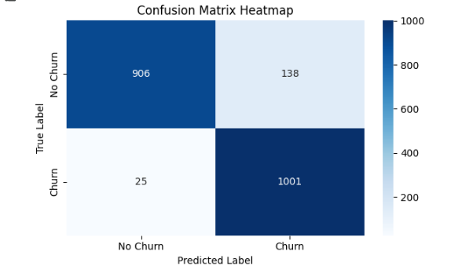
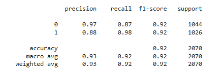

# Telco Customer Churn Prediction

This project uses the IBM Telco Customer Churn Dataset (public sample data) for educational purposes.

## 📌 Inspiration
To explore this type of models and learn more about the subject.

- New version from IBM: https://community.ibm.com/community/user/businessanalytics/blogs/steven-macko/2019/07/11/telco-customer-churn-1113
- Dataset on Kaggle: https://www.kaggle.com/datasets/blastchar/telco-customer-churn?utm_source=chatgpt.com

---

## 📂 Project Structure & Explanation

### 1. `load_data(path)`
Reads the CSV dataset and loads it into a pandas DataFrame.

### 2. `explore_data(df)`
Provides a quick overview of the dataset using `.head()`, `.info()`, `.describe()`, and missing values.

### 3. `clean_data(df)`
- Removes missing values and duplicate rows.

### 4. `preprocessing_data(df)`
- Label encodes all categorical columns.
- Performs upsampling to balance the dataset (same number of churned and not churned customers).

### 5. `feature_engineering(df)`
- Drops unimportant or redundant features like `customerID`, `PhoneService`, etc.

### 6. `model_training(df)`
- Splits data into train/test.
- Trains a `RandomForestClassifier` model.

### 7. `evaluate_model(model, X_test, y_test)`
- Evaluates model performance using accuracy, confusion matrix, and classification report.
  
  

### 8. `save_model_bundle(model, encoders)`
- Saves both the trained model and all LabelEncoders using `joblib` in a single file.

### 9. `load_model_bundle(path)`
- Loads the saved model and encoders back into memory.

### 10. `predict_new_data(new_df, model, encoders)`
- Applies the same cleaning, encoding, and feature engineering steps to new data and predicts churn.

### 11. `main()`
- Orchestrates the full pipeline from loading data, preprocessing, training, evaluating, and saving the model.

---

## 📦 Requirements
- pandas
- matplotlib
- scikit-learn
- joblib

You can install them using:

```
pip install pandas matplotlib prophet scikit-learn joblib
```

---

## 🧠 Notes
- The model is saved in `model_bundle.pkl` for later use.
- Feature importance function is present but commented out (can be activated if needed).

---

## ✅ Author
This project was implemented for educational purposes to demonstrate end-to-end machine learning pipeline on customer churn dataset by blal shaheen
